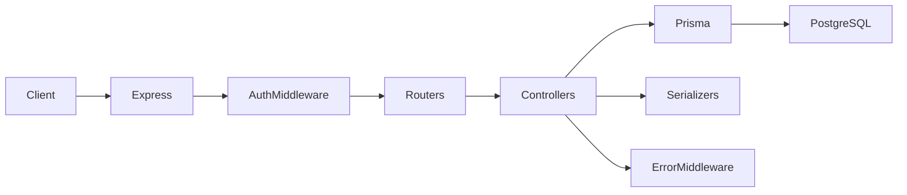

# Architecture

## Tech stack

| Layer | Technology |
|-------|------------|
| Runtime | Node.js (ES modules: `"type": "module"`) |
| HTTP | Express 4 |
| Language | TypeScript |
| Database | PostgreSQL |
| ORM | Prisma 7 (`@prisma/client`, client output: `generated/prisma`) |
| DB driver | `pg` via `@prisma/adapter-pg` |
| Auth | JWT (`jsonwebtoken`), passwords hashed with `bcryptjs` |
| Dev server | `tsx` |
| Package manager | Yarn classic (`yarn.lock`) |

## High-level diagram



Public routes skip `authMiddleware`; protected routes require a valid Bearer token. Errors bubble to `errorMiddleware` (see [API reference → Errors](./api.md#errors)).

## Repository layout

```
src/
  index.ts                 # App bootstrap: middleware, route mounts, shutdown hooks
  lib/                     # prisma client, AppError, asyncHandler
  middleware/              # authMiddleware, errorMiddleware
  _modules/
    auth/                  # register, login, me
    shop/                  # CRUD shops (scoped by user)
    attributes/            # product attributes + nested value delete
    products/              # products + nested variants
    dashboard/             # aggregated analytics for user’s shops
prisma/
  schema.prisma
  seed.ts
generated/prisma/          # Prisma-generated client (do not edit)
scripts/
  generate-module.ts       # Scaffold from schema.prisma
```

### Naming: `_modules`

Feature folders under `src/_modules/<domain>/` group:

- **`routes/index.ts`** — Express `Router`, HTTP verbs and paths
- **`controller/`** — Request handlers (call Prisma, validate, respond)
- **`serializers/`** — Shape API responses and compute derived fields (especially dashboard and product analytics)

Nested resources use a nested **`_modules/`** folder (e.g. `products/_modules/productVariants/`, `attributes/_modules/` for value deletion).

### Shared library (`src/lib`)

| Export | Role |
|--------|------|
| `prisma` | Singleton `PrismaClient` with Pg adapter |
| `AppError`, `ERROR_CODES` | Typed API errors with HTTP status and stable `case` / `code` |
| `asyncHandler` | Wraps async route handlers so `throw` and rejections reach `errorMiddleware` |

## Request lifecycle

1. **`express.json()`** parses JSON bodies; **`cors()`** runs for all routes.
2. **Routing** (`src/index.ts`):
   - **`/api/auth`** — mounted without global auth (register, login are public).
   - **`/api/shops`**, **`/api/attributes`**, **`/api/products`**, **`/api/dashboard`** — mounted **after** `authMiddleware` (Bearer JWT required).
3. **Controllers** typically use **`asyncHandler`** and **`throw new AppError(...)`** for expected failures.
4. **`errorMiddleware`** runs last: maps `AppError`, common Prisma codes, and unexpected errors to JSON responses.

## Data layer

- **`DATABASE_URL`** is required at startup (`src/lib/prisma.ts`).
- Config load order: **`.env.local`** then **`.env`** (via `dotenv`).
- Prisma schema lives in **`prisma/schema.prisma`**; client is generated into **`generated/prisma/`**.

### Domain model (conceptual)

- **User** owns **Shop**s.
- **Shop** has **Product**s, **ProductAttribute**s, and **Order**s.
- **Product** has **ProductVariant**s (price, stock).
- **ProductAttribute** has **ProductAttributeValue**s; variants link to values through **ProductVariantAttributeValue**.
- **Order** / **OrderItem** connect customers, revenue, and sold variants.

Exact fields and relations are defined in `prisma/schema.prisma`.

## Configuration

| Variable | Purpose |
|----------|---------|
| `DATABASE_URL` | PostgreSQL connection string (required) |
| `JWT_SECRET` | Secret for signing and verifying JWTs (defaults exist in code for dev; set in production) |
| `PORT` | HTTP port (default `8000`) |

## Module generator

`yarn generate` runs **`scripts/generate-module.ts`**, which parses **`schema.prisma`** and can scaffold CRUD-style modules. Use when adding new Prisma models to keep structure consistent.

## Tests

Automated tests live under **`test/`** and mirror **`src/_modules`**: each domain has **`unit/`** and **`integration/`** folders (plus **`test/lib/`** for shared code next to **`src/lib/`**). See [Testing](./testing.md).

## Docker

The API and PostgreSQL can be run with **`docker compose`** (see [Docker](./docker.md)): `Dockerfile`, `docker-compose.yml`, and `docker-entrypoint.sh` apply the schema (`db push` in the default compose file, or `migrate deploy` when `PRISMA_DB_PUSH=false`).

## Graceful shutdown

On **`SIGTERM`** / **`SIGINT`**, the process calls **`prisma.$disconnect()`** before exit so database connections close cleanly.
